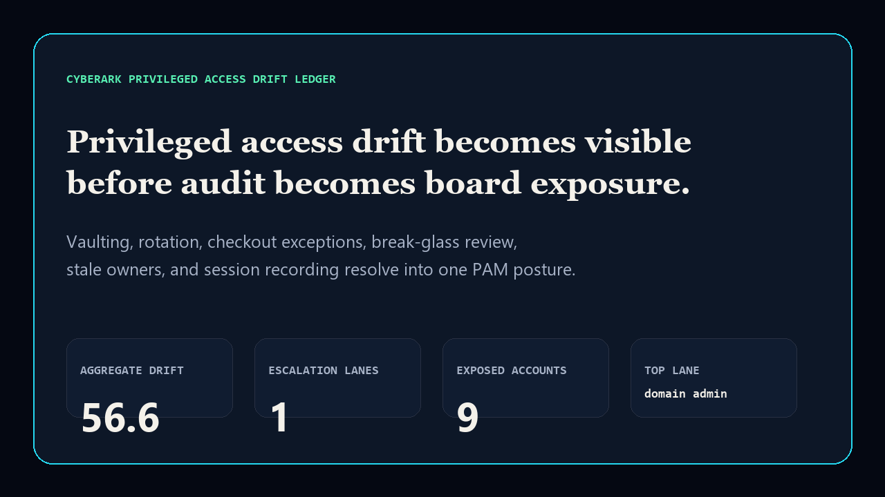
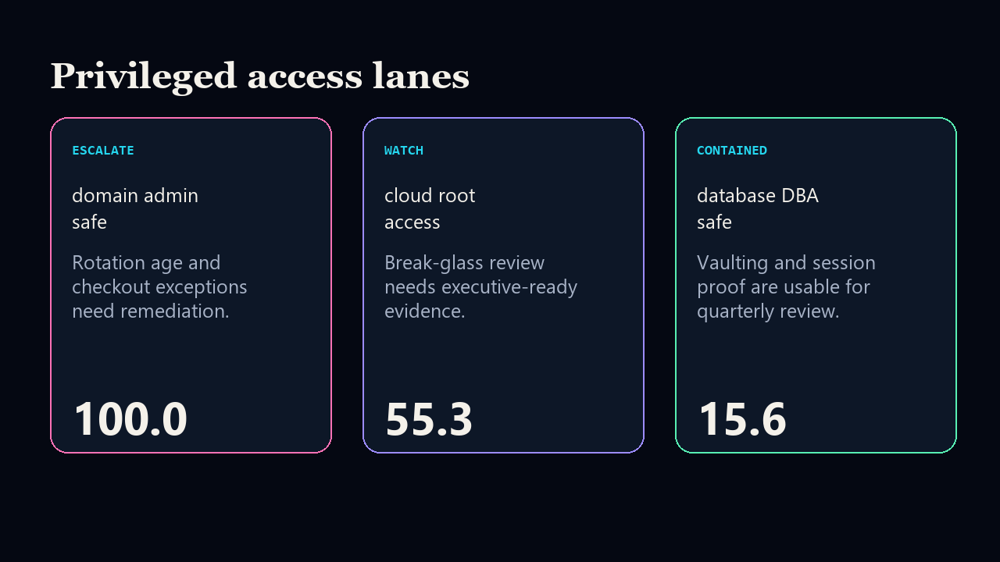

# cyberark-privileged-access-drift-ledger

[](https://github.com/mizcausevic-dev/cyberark-privileged-access-drift-ledger/actions/workflows/ci.yml)
[](https://github.com/mizcausevic-dev/cyberark-privileged-access-drift-ledger/actions/workflows/pages.yml)
[](LICENSE)

CyberArk-aligned privileged access drift ledger for vaulted coverage, rotation age, checkout-policy exceptions, break-glass review, stale ownership, and session recording coverage.

## Why this exists

- Privileged-access risk becomes expensive when vault coverage, rotation, checkout rules, and access review evidence drift separately.
- Executives need one PAM posture before audit findings turn into board exposure.
- Recruiters and buyers looking for `CyberArk / PAM / PowerShell / SQL / TypeScript` proof should see a real operator surface, not a keyword page.

## What it shows

- TypeScript scoring engine and static GitHub Pages proof surface.
- PowerShell scoring mirror for identity/security operations.
- SQL source contract for reviewed privileged-access evidence fields.
- Synthetic fixture and README screenshot package.

## Screenshots





## Local run

```bash
npm install
npm run verify
npm run prerender
```

## CLI

```bash
npx tsx src/cli.ts fixtures/privileged-access-drift.json
npx tsx src/cli.ts fixtures/privileged-access-drift.json --format=json
```

## Kinetic Gain fit

This repo expands the identity and security lane: CyberArk-style privileged-account control evidence becomes a board-readable operating surface for access reviews, audit posture, and remediation sequencing.
